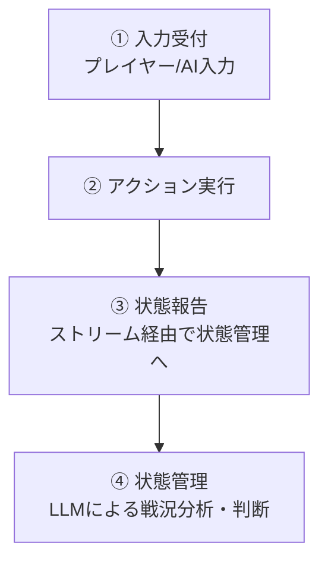
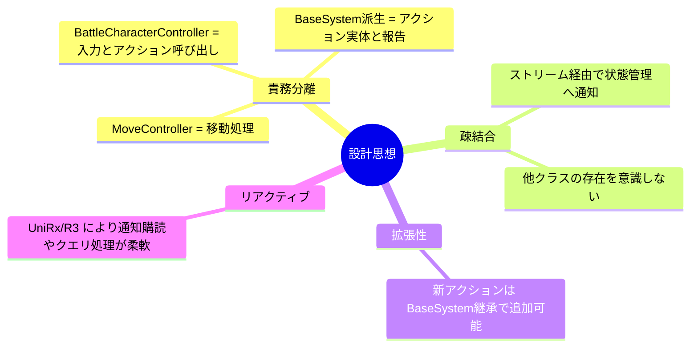

# キャラクター制御システム インターフェイス設計

## 実装範囲

キャラクター制御の全体像は以下の通りです。

今回の実装範囲は **② アクション実行** と **③ 状態報告** です。
①入力受付は AI の仕様未確定のため後回しにし、独立して動作可能な②③を先行構築します。

---

## 設計思想

* **BattleCharacterController** … 入力と実行判定を行う
* **BaseSystem<T>** … アクションの実装 + ストリーム通知
* **MoveController** … 共通の移動処理基盤
* **状態管理クラス** … ストリームを購読し、LLM に報告（まだ実装対象外）
---

# クラス詳細設計書

## BattleCharacterController

* **ベースクラス**: MonoBehaviour
* **ファイル**: BattleCharacterController.cs
* **名前空間**: LearningAIGame.CombatSystem.Core
* **責任範囲**: 入力受付、入力処理、移動処理

### 使用するデータ構造

| 名前            | 種別               | ファイル             | 名前空間                                | 概要                                  |
| ------------- | ---------------- | ---------------- | ----------------------------------- | ----------------------------------- |
| ActionSetting | ScriptableObject | ActionSetting.cs | LearningAIGame.CombatSystem.Setting | 各アクションの消費スタミナ、移動距離、移動速度、判定持続時間などを保持 |

### フィールド

| アクセス    | 名前             | 型             | 説明       |
| ------- | -------------- | ------------- | -------- |
| private | _attackSystem  | AttackSystem  | 攻撃実行クラス  |
| private | _defenseSystem | DefenseSystem | 防御実行クラス  |
| private | _actionSetting | ActionSetting | アクション設定値 |

### メソッド

| アクセス    | 名前                   | 引数                     | 戻り値         | 機能概要                             |
| ------- | -------------------- | ---------------------- | ----------- | -------------------------------- |
| public  | WeakAttackAct        | なし                     | void        | 弱攻撃を実行（コスト消費、攻撃開始）。              |
| public  | HeavyAttackAct       | なし                     | void        | 強攻撃を実行（コスト消費、攻撃開始）。              |
| public  | HeavyAttackCancel    | なし                     | void        | 強攻撃キャンセル（コスト消費、攻撃中かつキャンセル可能時のみ）。 |
| public  | HeavyAttackFeint     | なし                     | UniTaskVoid | 強攻撃 → 0.5秒待機 → キャンセルを順に実行。       |
| public  | ShootAct             | なし                     | void        | 射撃攻撃を実行。                         |
| public  | GuardDirectionChange | Vector2 guardDirection | void        | ガード方向変更。                         |
| public  | BlockingAct          | なし                     | void        | ブロッキング実行（コスト消費、防御通知）。            |
| public  | AvoidAct             | Vector2 moveVector     | void        | 回避実行（コスト消費、回避ベクトル・継続時間指定）。       |
| public  | MoveAct              | Vector2 moveVector     | void        | 移動実行（速度をActionSettingから取得）。      |
| private | InternalEnergyUse    | float useAmount        | void        | エネルギー消費処理。                       |

---

## BaseSystem<T>

* **ベースクラス**: MonoBehaviour
* **ファイル**: BaseSystem<T>.cs
* **名前空間**: LearningAIGame.CombatSystem.Core
* **責任範囲**: 行動関連報告、アクションに付随する移動

### 使用する列挙型

| 名前         | ファイル             | 概要       | 列挙子                   |
| ---------- | ---------------- | -------- | --------------------- |
| StanceType | BaseSystem<T>.cs | 攻撃/防御の方向 | Up, Left, Right, None |

### フィールド

| アクセス    | 名前              | 型              | 説明      |
| ------- | --------------- | -------------- | ------- |
| private | _moveController | MoveController | 移動制御クラス |

### メソッド

| アクセス      | 名前                 | 引数      | 戻り値  | 機能概要                 |
| --------- | ------------------ | ------- | ---- | -------------------- |
| protected | **NotifyObservers<T>** | T value | void | **状態管理クラスにデータをストリーム通知。** |

#### 補足
* **メソッド名:** `NotifyObservers<T>`
* **メソッドの種類:** `BaseSystem<T>` の **`protected`** メソッド
* **引数:** `T value`
* **返り値:** `void`
* **機能:**
    * ジェネリック型 `T` のデータをストリームに流し、状態管理クラスに通知を行います。

---

## AttackSystem

* **ベースクラス**: BaseSystem<AttackInfo>
* **ファイル**: AttackSystem.cs
* **名前空間**: LearningAIGame.CombatSystem.Systems
* **責任範囲**: 攻撃関連の報告、アクションに付随する移動

### 使用する構造体

| 名前         | フィールド                                                                      | 概要                                    |
| ---------- | -------------------------------------------------------------------------- | ------------------------------------- |
| AttackInfo | StanceType stance, float damage, bool isHeavy, AttackReportType reportType | 攻撃方向、ダメージ値、攻撃種別（軽/重）、報告区分（開始/キャンセルなど） |

### メソッド

| アクセス   | 名前                | 引数                                                   | 戻り値  | 機能概要                      |
| ------ | ----------------- | ---------------------------------------------------- | ---- | ------------------------- |
| public | WeakAttack        | float damage, Vector2 moveVector, float moveDuration | void | 攻撃開始をNotifyObservers()で通知し、AddForceで踏み込み移動。 |
| public | HeavyAttack       | float damage, Vector2 moveVector, float moveDuration | void | 攻撃開始をNotifyObservers()で通知し、AddForceで踏み込み移動。 |
| public | HeavyAttackCancel | なし                                                   | void | Stopで移動停止し、攻撃キャンセルを通知。    |

---

## DefenseSystem

* **ベースクラス**: BaseSystem<DefenseInfo>
* **ファイル**: DefenseSystem.cs
* **名前空間**: LearningAIGame.CombatSystem.Systems
* **責任範囲**: 防御関連の報告、アクションに付随する移動

### 使用する構造体

| 名前          | フィールド                                           | 概要                                  |
| ----------- | ----------------------------------------------- | ----------------------------------- |
| DefenseInfo | StanceType stance, DefenseReportType reportType | 防御方向、報告区分（防御方向変更 / ブロッキング開始 / 回避開始） |

### メソッド

| アクセス   | 名前               | 引数                                       | 戻り値  | 機能概要                    |
| ------ | ---------------- | ---------------------------------------- | ---- | ----------------------- |
| public | GuardStateChange | Vector2 guardDirection                   | void | ガード方向を計算し、防御方向変更をNotifyObservers()で通知。    |
| public | Blocking         | なし                                       | void | ブロッキング開始をNotifyObservers()で通知。            |
| public | Avoid            | Vector2 avoidVector, float avoidDuration | void | 回避開始をNotifyObservers()で通知し、AddForceで移動実行。 |

---

## MoveController

* **ベースクラス**: MonoBehaviour
* **ファイル**: MoveController.cs
* **名前空間**: LearningAIGame.CombatSystem.Core
* **責任範囲**: 移動速度管理

### 使用する列挙型

| 名前       | 概要      | 列挙子                      |
| -------- | ------- | ------------------------ |
| MoveType | 移動種類の区分 | Velocity, AddForce, None |

### フィールド

| アクセス    | 名前             | 型         | 説明     |
| ------- | -------------- | --------- | ------ |
| private | _rb            | RigidBody | 移動処理対象 |
| private | _moveStartTime | float     | 移動開始時間 |
| private | _moveDuration  | float     | 移動継続時間 |
| private | _moveDirection | Vector2   | 移動ベクトル |
| private | _moveType      | MoveType  | 移動種類   |

### メソッド

| アクセス    | 名前                | 引数                                     | 戻り値  | 機能概要                             |
| ------- | ----------------- | -------------------------------------- | ---- | -------------------------------- |
| public  | MoveStart         | Vector2 moveVector                     | void | 通常移動開始（Velocity設定）。              |
| public  | AddForce          | Vector2 moveVector, float moveDuration | void | 加速度付き移動開始（AddForce設定）。           |
| public  | Stop              | なし                                     | void | 停止処理（MoveTypeをNoneに設定）。          |
| private | InternalCalcSpeed | なし                                     | void | 毎フレーム速度計算。移動タイプに応じてRigidBodyに反映。 |

#### 補足
* **メソッド名:** `InternalCalcSpeed`
* **引数:** なし
* **返り値:** `void`
* **機能:**
    * `FixedUpdate()` の最後に毎フレーム呼び出されます。
    * 移動タイプが **`None`** の場合、何もせずに早期リターンします。
    * 早期リターンしない場合、移動タイプによって以下の処理に分岐します。
        * **移動タイプが `Velocity` の場合:**
            * `_rb` の速度に `_moveVector` を設定します。
        * **移動タイプが `AddForce` の場合:**
            * `_rb` の速度に `_moveVector * math.sin(((Time.Time - _moveStartTime) / _moveDuration) * math.PI)` を設定します。

---

* **後処理:**
    * 上記の処理終了後、`Time.Time - _moveStartTime` が `_moveDuration` を超えていたら、`_moveVector` に `Vector2.zero` を代入し、`_moveType` を `None` に設定します。

---

## 依存関係まとめ

### クラス間の関係性
| クラス名 | 依存先 | 主な関係 |
| :--- | :--- | :--- |
| `BattleCharacterController` | `AttackSystem`、`DefenseSystem`、`ActionSetting`、`MoveController` | アクションの呼び出しと移動制御を行う。 |
| `BaseSystem<T>` | `MoveController` | 共通の移動処理を利用。 |
| `MoveController` | `RigidBody` | 実際の物理挙動を反映。 |
---
